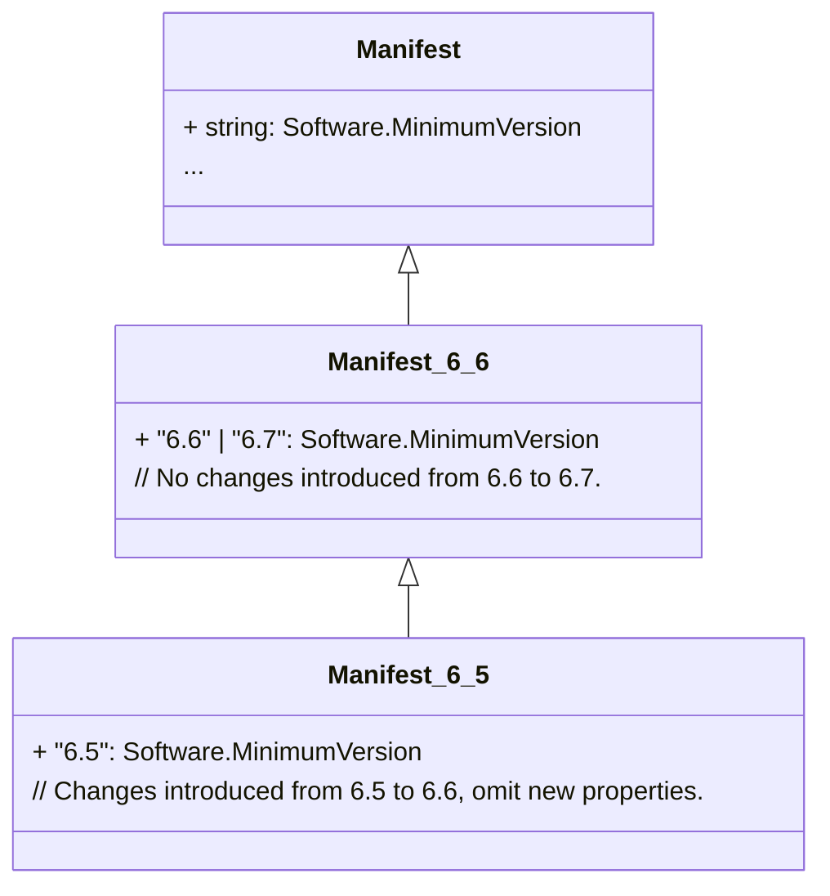
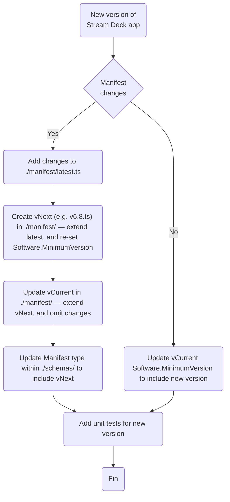

# Stream Deck Plugin Schemas

## Manifest

Manifest versioning is achieved using reverse-migrations, by extending the versions successor and utilizing the `Omit` utility type to _remove_ new features, for example:



### Glossary

-   vLatest — The current version, with a flat `Software.MinimumVersion`.
-   vCurrent — The current version, for example `v6.7.ts`.
-   vNext — The new version being introduced, for example `v6.8.ts`.

### File Structure Example

Manifest versions, and the type responsible for generating the JSON schema, are located in the following file structure:

```
./src/streamdeck/plugins/
├── manifest/
│   ├── latest.ts  # vLatest — vCurrent, with flat Software.MinimumVersion, e.g. "6.5" | "6.6" | "6.7"
|   ├── v6.5.ts
|   ├── v6.6.ts
|   └── v6.7.ts    # vCurrent, with specific Software.MinimumVersion, e.g. "6.7"
└── schemas.ts
```

### Adding Versions of Stream Deck

When adding a new version of Stream Deck, its important to consider if there are manifest changes. If simply adding a new version of `Software.MinimumVersion`, vCurrent can be updated to include the new version. If there are new properties introduced, a reverse-migration is needed.

The following flowchart depicts how to introduce a new version of Stream Deck to the manifest type and JSON schema.


