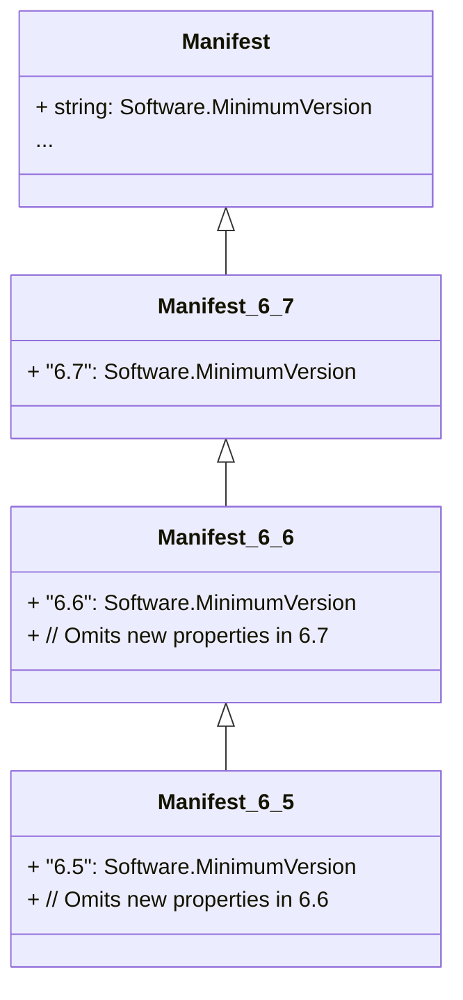
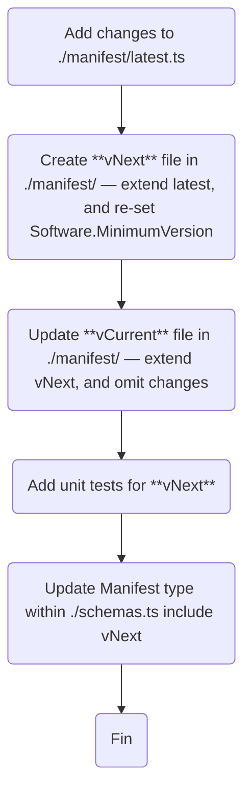

# Stream Deck Plugin Schemas

## Manifest Versioning

Manifest versioning is achieved on reverse-migration approach, utilizing the `Omit` utility type. Each version extends their successor, and omits new properties introduced.

For example:



### Versions

#### vLatest

-   The current structure of the manifest is stored within `latest.ts`.
-   `Software.MinimumVersion` is a union of _all_ possible versions.
-   All types within `latest.ts` reflect their current structure.

#### Version Specific

-   All versions, including vCurrent, are represented in separate files.
-   Versions use the file name format `v{major}.{minor}.ts`.
-   Versions extend their successors.
    -   For example, v0 extends v1, v1 extends v2, etc.
    -   vCurrent extends vLatest.
-   Changes are _omitted_ when extending, thus reflecting the migration.

#### File Structure

```
./manifest
├── latest.ts
├── v6.4.ts      # Extends v6.5
├── v6.5.ts      # Extends v6.6
├── v6.6.ts      # Extends v6.7
└── v6.7.ts      # vCurrent, extends vLatest
```

### Migration

#### Steps

1. Within `latest.ts`
    - Add changes to required structures.
1. Create file for vNext, for example `6.8.ts`.
    - Re-setting the `Software.MinimumVersion` to vNext, for example `"6.8"`.
1. Update vCurrent
    - To extend vNext.
    - Apply reverse-migration by omitting new changes.
1. Add unit tests for vNext.
1. Update Manifest type within ./schemas.ts include vNext.

#### Flowchart


